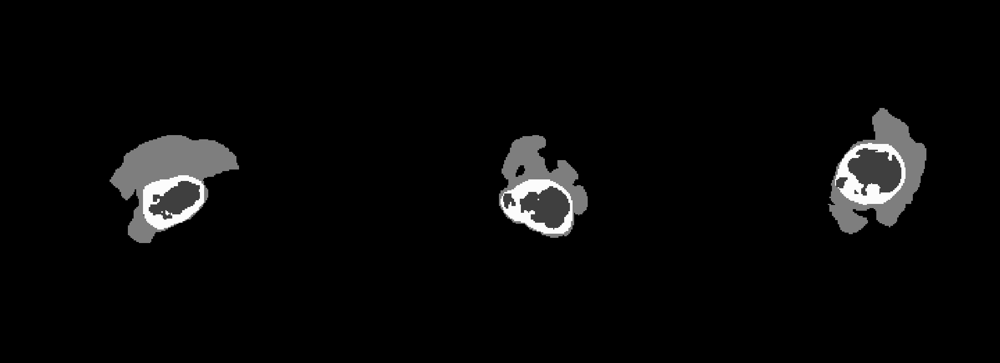
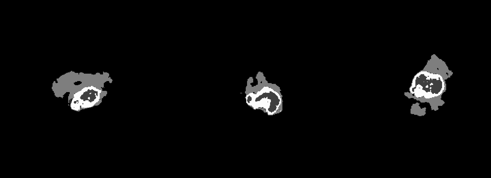
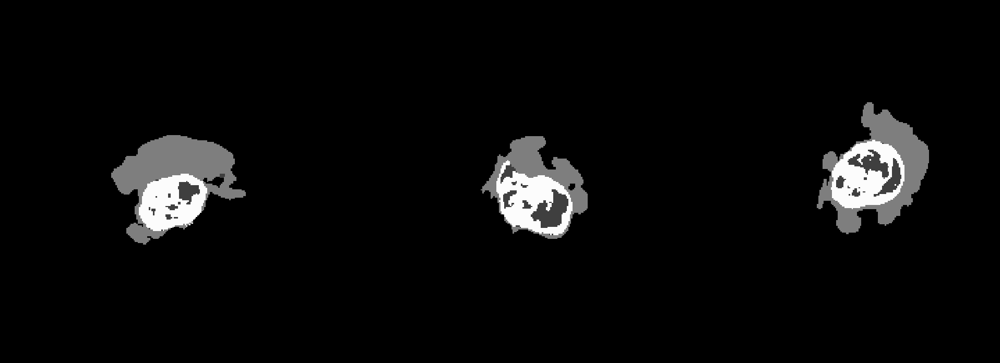
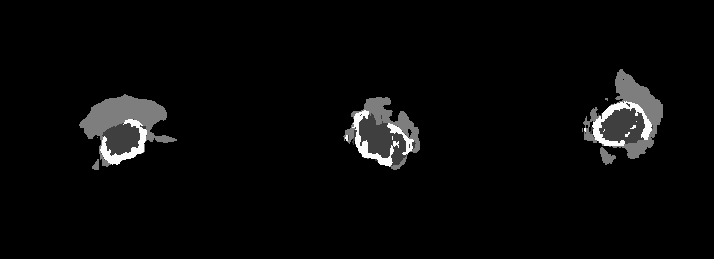
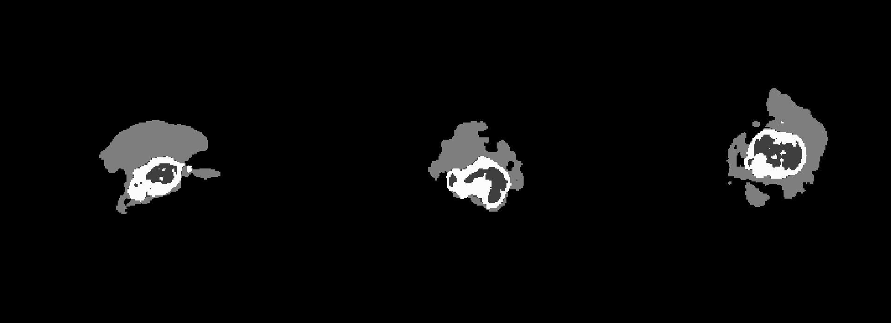

# OncoTUM
[](https://www.repostatus.org/#active) 

OncoTUM is a **tum**our segmentation package for medical images, that are distorted due its **onco**logical disease. To 
perform the segmentation processes, the convolutional network (unet) of T. Henry et al. [1] is adapted. Therefore, the
code (https://github.com/lescientifik/open_brats2020) is tailored with this repository to the framework of <a href="https://github.com/masud-src/OncoFEM">OncoFEM</a>. 
Due to that, no fork is done and the algorithm is appended about a modality agnostic mode and cpu mode. Furthermore, the 
results of tested modality agnostic modes are shown in the following.

* [Exemplary results](#results)
* [Integration of OncoTUM](#integration)
* [Software availability](#software)
* [Installation and machine requirements](#installation)
  * [Short installation](#short_install)
  * [Detailed installation](#detailed_install)
* [Tutorial](#tutorial)
* [How to](#howto)
* [Known bugs](#bugs)
* [How to cite](#howtocite)
* [Literature](#literature)

## <a id="results"></a> Examplary results

In the following the results of the modality agnostic modes are compared to the full modality mode. 

The following image shows the segmentation based only on the t1 image.

<p align="center">
 
</p>

The next image shows the segmentation based on the t1gd image.

<p align="center">
 
</p>

The next image shows the segmentation based on the t2 image.

<p align="center">
 
</p>

The next image shows the segmentation based on the flair image.

<p align="center">
 
</p>

The next image shows the segmentation based on the full modality image.
<p align="center">
 
</p>

The algorithm is capable to take also just a reduced set of modalities, e.g. (t1, t1gd, flair). 

## <a id="integration"></a> Integration of OncoTUM
OncoTUM is part of a module based umbrella software for numerical simulations of patient-specific cancer diseases, see 
following figure. From given input states of medical images the disease is modelled and its evolution is simulated 
giving possible predictions. In this way, a digital cancer patient is created, which could be used as a basis for 
further research, as a decision-making tool for doctors in diagnosis and treatment and as an additional illustrative 
demonstrator for enabling patients understand their individual disease. All parts resolve to an open-access framework, 
that is ment to be an accelerator for the digital cancer patient. Each module can be installed and run independently. 
The current state of development comprises the following modules

- OncoFEM (https://github.com/masud-src/OncoFEM)
- OncoGEN (https://github.com/masud-src/OncoGEN)
- OncoTUM (https://github.com/masud-src/OncoTUM)
- OncoSTR (https://github.com/masud-src/OncoSTR)
<p align="center">
 
</p>
 
## <a id="software"></a> Software availability

You can either follow the installation instruction below or use the already pre-installed virtual boxes via the 
following Links:

- Version 0.1.0:  https://doi.org/10.18419/darus-4651

## <a id="installation"></a> Installation and Machine Requirements

This installation was tested on
- a virtual box created with a linux mint 21.2 cinnamon, 64 bit system and 8 GB RAM on a 
local machine (intel cpu i7-9700k with 3.6 GHz, 128 GB RAM). 
- a MacBook Pro (Mac14,7) with a Apple M2 Chip (8 cores) and 24 GB memory. The integrated GPU got 10 cores.

It is possible to install OncoTUM as a stand-alone or 
together with OncoFEM (https://github.com/masud-src/OncoFEM) and its anaconda environment. 

### <a id="short_install"></a> Short installation

To install execute the following shell script. First, you may need to make it executable and afterwards you need to 
restart the terminal to actualise the changes.
````bash
git clone https://github.com/masud-src/OncoTUM/
cd OncoTUM
chmod +x install_oncotum.sh
./install_oncotum.sh
````

### <a id="detailed_install"></a> Detailed installation

To activate the oncofem environment and install OncoTUM into that, activate oncofem first via
````bash
conda activate oncofem
````
Continue with the following lines either in that environment or global
````bash
git clone https://github.com/masud-src/OncoTUM/
cd OncoTUM
pip install -r requirements.txt
````
OncoTUM is installed on the local system with
````bash
python3 -m pip install .
````
To use prepared weights download the necessary material provided on DaRUS 
(https://darus.uni-stuttgart.de/dataset.xhtml?persistentId=doi:10.18419/darus-4647) and place the 'data' folder next to
the oncotum folder. The following script will also set path variables and you should restart the terminal
````bash
if [[ -z "${ONCOTUM_DIR}" ]]; then
    ONCOTUM_DIR="$(cd "$(dirname "${BASH_SOURCE[0]}")" && pwd)"
fi

USER_HOME="$HOME"

add_to_path_unix() {
    if ! grep -q "export ONCOTUM=" ~/.bashrc; then
        echo "export ONCOTUM=$ONCOTUM_DIR" >> ~/.bashrc
        echo "ONCOTUM has been added to your PATH."
        echo "Please run 'source ~/.bashrc' to apply the changes."
    else
        echo "ONCOTUM is already set in your PATH."
    fi
}

add_to_path_windows() {
    local script_file="$HOME/set_config.bat"
    if ! grep -q "setx PATH" "$script_file" 2>/dev/null; then
        echo "@echo off" > "$script_file"
        echo "setx PATH \"%PATH%;$ONCOTUM_DIR\"" >> "$script_file"
        echo "ONCOTUM has been added to your PATH."
        echo "Please restart your command prompt to apply the changes."
    else
        echo "ONCOTUM is already set in your PATH."
    fi
}

create_config_file(){
    CONFIG_FILE="$ONCOTUM_DIR/config.ini"
    {
        echo "[directories]"
        echo "STUDIES_DIR: $USER_HOME/studies/"
        echo "RUN_DIR: $USER_HOME/run/"
        echo "[models]"
        echo "FULL_MODEL_DIR: $ONCOTUM_DIR/data/tumor_segmentation/full/hyperparam.yaml"
        echo "CYCLE_1_4_MODEL_T1_DIR: $ONCOTUM_DIR/data/tumor_segmentation/t1/hyperparam.yaml"
        echo "CYCLE_1_4_MODEL_T1GD_DIR: $ONCOTUM_DIR/data/tumor_segmentation/t1gd/hyperparam.yaml"
        echo "CYCLE_1_4_MODEL_T2_DIR: $ONCOTUM_DIR/data/tumor_segmentation/t2/hyperparam.yaml"
        echo "CYCLE_1_4_MODEL_FLAIR_DIR: $ONCOTUM_DIR/data/tumor_segmentation/flair/hyperparam.yaml"

    } > "$CONFIG_FILE"
    echo "Config file created."
}

case "$(uname -s)" in
    Linux*)     add_to_path_unix ;;
    Darwin*)    add_to_path_unix ;;
    *)          echo "Unsupported OS. Please add the ONCOTUM directory to your PATH manually." ;;
esac

if [[ "$OS" == "Windows_NT" ]]; then
    add_to_path_windows
fi

echo "Downloading weights started!"
curl --output data https://darus.uni-stuttgart.de/api/access/dataset/:persistentId/?persistentId=doi:10.18419/darus-4647
echo "Download weights complete!"

create_config_file
````
The package can now be used. To test the correct installation, run a python script with the following code line.
````bash
import oncotum
````

## <a id="tutorial"></a> Tutorial

There is a tutorial for the umbrella software project provided on DaRUS 
(https://darus.uni-stuttgart.de/dataset.xhtml?persistentId=doi:10.18419/darus-4639). You can download and run the
tutorial_structure_segmentation.py file by run the following lines in your desired directory.
````bash
curl --output tutorial https:/darus.uni-stuttgart.de/api/access/dataset/:persistentId/?persistentId=doi:10.18419/darus-3679
````
To run this tutorial, you also need to download the first six training datasets from kaggle 
(https://www.kaggle.com/datasets/awsaf49/brats20-dataset-training-validation). Either you download from the web
interface and save it in the following location
````bash
tutorial/data/BraTS/
````
or you use the kaggle API. Be aware that this will download the full set and its recommended to use the web interface
````bash
kaggle datasets download -d awsaf49/brats20-dataset-training-validation -p .
unzip brats20-dataset-training-validation.zip "BraTS20_Training_001/*" "BraTS20_Training_002/*" "BraTS20_Training_003/*" "BraTS20_Training_004/*" "BraTS20_Training_005/*" "BraTS20_Training_006/*" unzip brats20-dataset-training-validation.zip "BraTS20_Training_001/*" "BraTS20_Training_002/*" "BraTS20_Training_003/*" "BraTS20_Training_004/*" "BraTS20_Training_005/*" "BraTS20_Training_006/*" -d ./tutorial/data/BraTS/
````
The tutorial can be started with
````bash
conda activate oncotum
python oncotum_tut_01_inference.py
````

## <a id="howto"></a> How To

You can modify the existing algorithms, respectively expand the existing by your own. Therefore, you can fork and ask 
for pull requests.

## <a id="bugs"></a> Known bugs

Sometimes the training in cpu modes fails in non-reproducible errors.

## <a id="howtocite"></a> How to cite

TBD

## <a id="literature"></a> Literature

<sup>1</sup> Henry, T. et al. (2021). Brain Tumor Segmentation with Self-ensembled, Deeply-Supervised 3D U-Net Neural 
             Networks: A BraTS 2020 Challenge Solution. In: Crimi, A., Bakas, S. (eds) Brainlesion: Glioma, Multiple 
             Sclerosis, Stroke and Traumatic Brain Injuries. BrainLes 2020. Lecture Notes in Computer Science(), 
             vol 12658. Springer, Cham. https://doi.org/10.1007/978-3-030-72084-1_30
