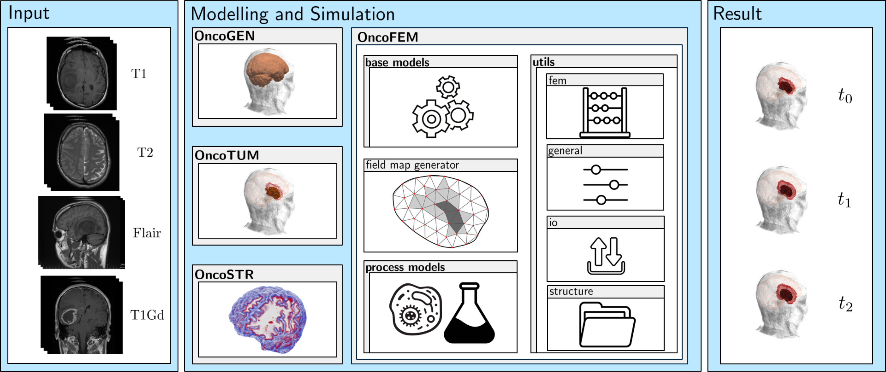

# OncoTUM

OncoTUM is a **tum**our segmentation package for medical images that are distorted due its **onco**logical disease. To 
perform the segmentation processes, the convolutional network (unet) of T. Henry et al. [1] is adapted. Therefore, the
code (https://github.com/lescientifik/open_brats2020) is adapted to the framework of OncoFEM. The algorithm is about 
a modality agnostic mode and cpu mode appended. The results of testet modality agnostic modes are shown in the 
following.

## Examplary results

In the following the results of the modality agnostic modes are compared to the full modality mode. 

The first image shows the original modalities.


The following image shows the segmentation based only on the t1 image.


The next image shows the segmentation based on the t1gd image.


The next image shows the segmentation based on the t2 image.


The next image shows the segmentation based on the flair image.


The next image shows the segmentation based on the full modality image.


The algorithm is capable  can also take different 

## Integration of OncoTUM
OncoTUM is part of a module based umbrella software for numerical simulations of patient-specific cancer diseases, see 
the following figure. From given input states of medical images the disease is modelled and its evolution is simulated 
giving possible predictions. In this way, a digital cancer patient is created, which could be used as a basis for 
further research, as a decision-making tool for doctors in diagnosis and treatment and as an additional illustrative 
demonstrator for enabling patients understand their individual disease. **OncoFEM** is an open-access framework, that is 
ment to be an accelerator for the digital cancer patient. Each module can be installed and run independently. The 
current state of development comprises the following modules

- OncoFEM (https://github.com/masud-src/OncoFEM)
- OncoGEN (https://github.com/masud-src/OncoGEN)
- OncoTUM (https://github.com/masud-src/OncoTUM)
- OncoSTR (https://github.com/masud-src/OncoSTR)


 
## Software availability

You can either follow the installation instruction below or use the already pre-installed virtual boxes via the 
following Links:

- Version 1.0:  https://doi.org/10.18419/darus-3720

## Installation and Machine Requirements

There are two different options the installation can be done. First, is the stand-alone installation, where OncoTUM is
simply installed via pip. The other way is to install OncoFEM (https://github.com/masud-src/OncoFEM) and its anaconda
environment first and add the missing packages into that. This installation was tested on a virtual box created with a 
linux mint 21.2 cinnamon, 64 bit system and 8 GB RAM on a local machine (intel cpu i7-9700k with 3.6 GHz, 128 GB RAM).

### Stand-alone installation

- Perform the following line in your preferred environment
````bash
git clone https://github.com/masud-src/OncoTUM/
cd OncoTUM
pip install -r requirements.txt
````
- Install oncotum on the local system with
````bash
python3 -m pip install .
````
- To use prepared weights download the necessary material
````bash

````
- The package can now be used. To test the correct installation, run a python script with the following code line.
````bash
import oncotum
````

### Install on existing OncoFEM environment

- Download this package and activate the oncofem environment. 
````bash
git clone https://github.com/masud-src/OncoTUM/
cd OncoTUM
conda activate oncofem
pip install -r requirements.txt
````
- To use prepared weights download the necessary material
````bash

````
- The package can now be used. To test the correct installation, run a python script with the following code line.
````bash
import oncotum
````

## Tutorial

TBD

## How To

You can modify the existing algorithms, respectively expand the existing by your own. Therefore, you can fork and ask 
for pull requests.

## Literature

<sup>1</sup> Henry, T. et al. (2021). Brain Tumor Segmentation with Self-ensembled, Deeply-Supervised 3D U-Net Neural 
             Networks: A BraTS 2020 Challenge Solution. In: Crimi, A., Bakas, S. (eds) Brainlesion: Glioma, Multiple 
             Sclerosis, Stroke and Traumatic Brain Injuries. BrainLes 2020. Lecture Notes in Computer Science(), 
             vol 12658. Springer, Cham. https://doi.org/10.1007/978-3-030-72084-1_30

## About

OncoTUM is written by Marlon Suditsch
